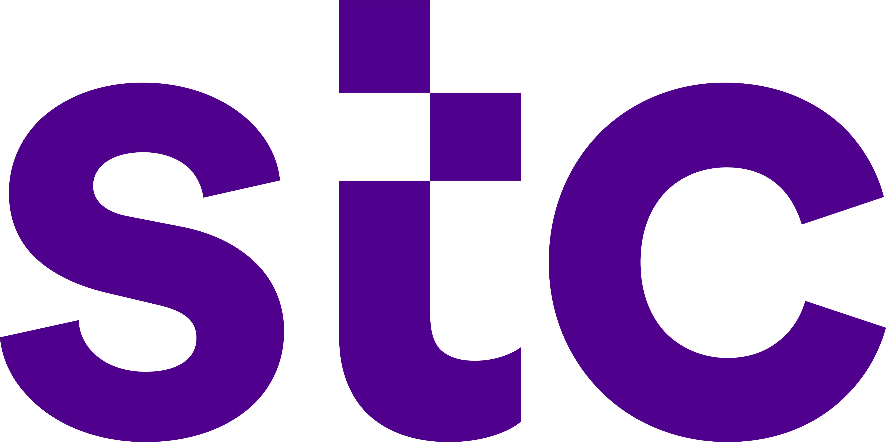

# Riyadh Air - Agentic AI Technical Hands-on Labs

### 🧠 What is the Agentic AI Bootcamp?

The Agentic AI Bootcamp is a hands-on, modular learning experience designed by IBM Client Engineering for Clients & Ecosystem. This bootcamp empowers you to explore and experiment with cutting-edge GenAI technologies to build AI-powered agents and workflows tailored to your needs.

### 🔥 Technologies Covered

This Bootcamp covers a rich ecosystem of AI technologies, including:

✅ [IBM watsonx Orchestrate](https://www.ibm.com/watsonx/orchestrate) – Automate business workflows with AI agents \
✅ [IBM watsonx.ai](https://www.ibm.com/watsonx/ai) – Build, deploy, and fine-tune AI models \
✅ [IBM Agent Lab](https://www.ibm.com/docs/en/watsonx/saas?topic=solutions-agent-lab-beta) – Experiment with AI agents in an interactive environment \
✅ [LangGraph](https://github.com/langchain-ai/langgraph) – Build AI workflows using LangChain’s graph-based framework \
✅ [IBM BeeAI](https://github.com/i-am-bee/beeai-framework) – IBM Research’s cutting-edge AI experimentation framework \
✅ [CrewAI](https://github.com/ai-crew/crewAI) – Multi-agent collaboration made easy \
... and much more! 🚀

###  📌 Getting Started
1️⃣ **Complete the [Setup Activities](self-guided-labs/lab-0-setup-activities/README.md)** – Run the Labs in a ready-to-use environment \
2️⃣ **Use Our MURAL [Template](https://app.mural.co/t/clientengineeringmea0786/m/clientengineeringmea0786/1746619489612/ad31646ea2bd0c167929b75ae8e6178257e5157e?sender=u7d5087fd786eadd379b12927)** – Bring Your Own Use Case and design your Agentic AI workflows \
3️⃣ [**Pick Your Labs**](./self-guided-labs/README.md) – Choose from the list of Labs, general use-cases or industry-specific \
4️⃣ **Build, Test, and Iterate!** – Experiment, refine, and enhance your AI solutions

### 🤝 Need Help?
If you face any issues, or have any questions, reach out to **Client Engineering Saudi Advisory Squad**.

### 🧠 (Optional) Reading Material
You may find it useful to review the compiled [reading material](reading-material.md) (including video series) to familiarise yourself with IBM watsonx.ai, the basics of Foundation Models and Generative AI and IBM's Foundation Model Strategy.
