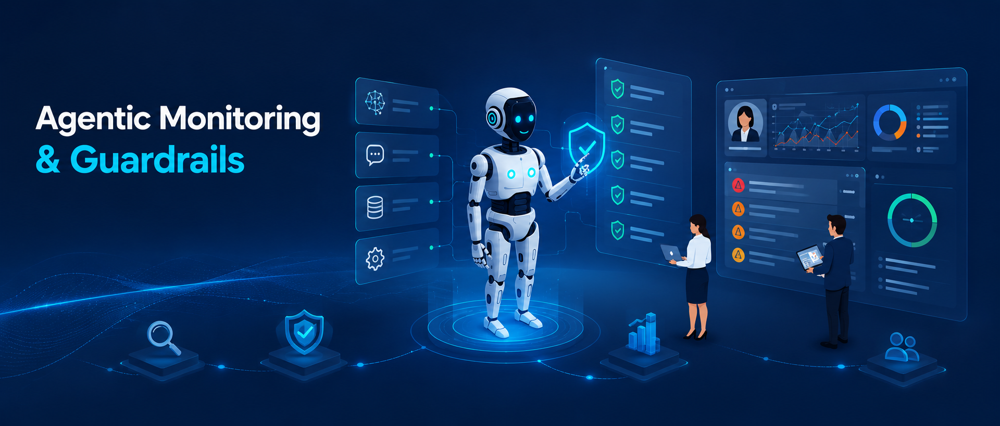

# Mobily - Control and Govern AI Agents — Hands-on Lab

## About These Labs

This is a set of **technical, self-paced labs** for learning how to control and govern AI agents with **IBM watsonx Orchestrate** and its **Agentic Control Plane**. You can work through them on your own schedule, one lab at a time.

You'll follow Imani, an AI Engineer at **ABC Car Dealership**, as she builds a governed agentic app around a **Master Car Buying Agent**. That agent coordinates a Car Research Agent (RAG over the vehicle catalog) and a third-party Google Search Agent (A2A). Lab by lab, you'll add controls for the main risks of Generative AI: data poisoning, prompt injection, hallucinations, PII leakage, and agent sprawl. You'll also set up debugging, automated evaluation, real-time monitoring, and alerting.

**Before you start:** You'll need access to a watsonx Orchestrate instance, plus the third-party agent endpoint URL and API key from your instructor. Start with [Lab 0: Scenario & Objective](./labs/lab-0-scenario-objective/README.md) for the full scenario, architecture, and prerequisites. Then do the labs in order. Lab 8 is optional and requires Python development skills.

## Agenda

<b>Self-Paced Labs</b>

| Name | Lab / Tutorial | Description | Tasks | Duration |
|------|-----------------|--------------|-------|----------|
| [**0. Scenario & Objective**](./labs/lab-0-scenario-objective/README.md) | *Tutorial* | Meet Imani, an AI Engineer at ABC Car Dealership, and understand the risks she's trying to address (prompt injection, hallucinations, agent sprawl, PII leakage) before building the agentic control layer. | • Review the ABC Car Dealership scenario.   • Review the objective and business value.   • Review the reference architecture. | 15 mins |
| [**1. Data Poisoning**](./labs/lab-1-data-poisoning/README.md) | *Lab* | Protect AI agents from data poisoning attacks by implementing guidelines that validate outputs and prevent malicious information from reaching users. | • Implement output-validation guardrails.   • Test against a poisoned/malicious input.   • Confirm malicious output is blocked. | 20-30 mins |
| [**2. Importing External Agents**](./labs/lab-2-importing-external-agents/README.md) | *Lab* | Enable the integration of external agents living in IBM Cloud, Google Cloud, or AWS into the governed environment. | • Import an external (3rd-party A2A) agent.   • Register it with the Master Agent.   • Verify it responds within governance controls. | 20-30 mins |
| [**3. PII Leakage**](./labs/lab-3-pii-leakage/README.md) | *Lab* | Protect Personal Identifiable Information that might be present in knowledge bases or generated by agent tools. | • Scan knowledge base for PII.   • Apply PII-masking guardrail.   • Verify agent output no longer leaks PII. | 20-30 mins |
| [**4. Debugging**](./labs/lab-4-debugging/README.md) | *Lab* | Diagnose tool/agent failures, find root cause, and quickly fix issues. | • Reproduce a failed agent invocation.   • Trace the root cause.   • Apply and verify the fix. | 20-30 mins |
| [**5. Automatic Evaluation**](./labs/lab-5-automatic-evaluation/README.md) | *Lab* | Systematically test and debug agents using automated test cases, performance metrics, and debugging tools to ensure reliability before deployment. | • Run automated test cases.   • Review quality/performance metrics.   • Flag and resolve failing cases. | 20-30 mins |
| [**6. Real-time Monitoring**](./labs/lab-6-real-time-monitoring/README.md) | *Lab* | Track agent performance in production through analytics dashboards that monitor success rates, user feedback, and content safety indicators. | • Open the Agentic Control Plane dashboard.   • Monitor active agents, messages, and latency.   • Review alerts, incidents, and insights. | 20-30 mins |
| [**7. Dashboard and Agent Analytics**](./labs/lab-7-dashboard-analytics/README.md) | *Lab* | Get a 360-degree view of your entire agentic system, including analytics, alerts, incidents, and more. | • Review agent analytics (native / imported / external agents).   • Review "Needs Attention" alerts and incidents.   • Investigate a flagged alert. | 20-30 mins |
| [**8. Custom Guardrails (Optional)**](./labs/lab-8-custom-guardrails/README.md) | *Lab* | Create fully customizable guardrails via Python scripts that can be executed before or after the agent invocation. Requires development/technical skills. | • Write a custom pre-invocation guardrail script.   • Write a custom post-invocation guardrail script.   • Test both hooks against the Master Car Buying Agent. | 20-30 mins |

