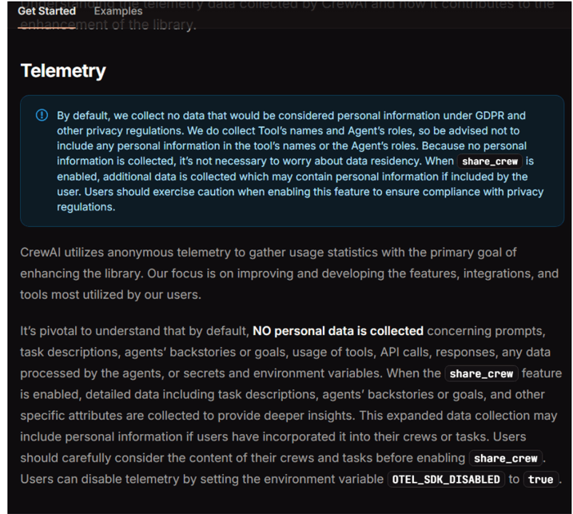
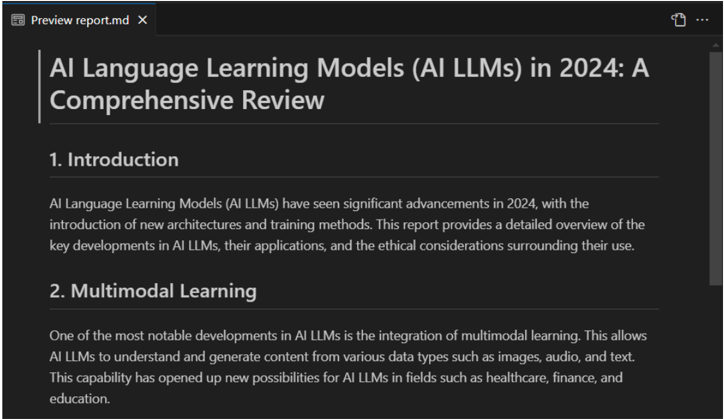
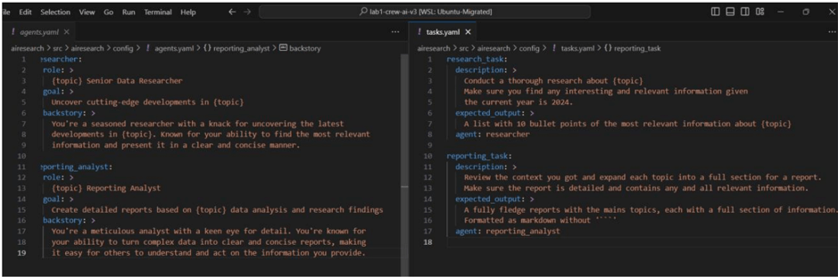
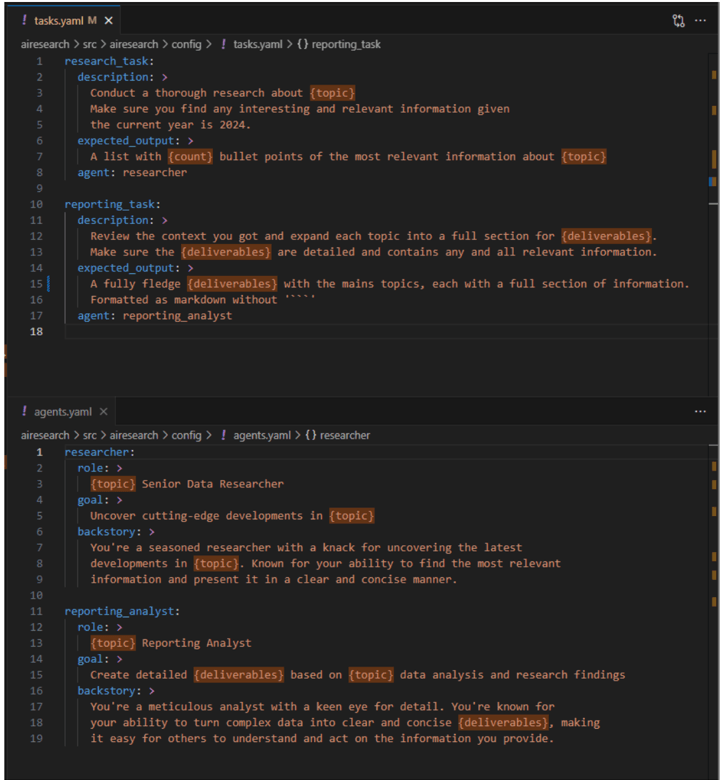
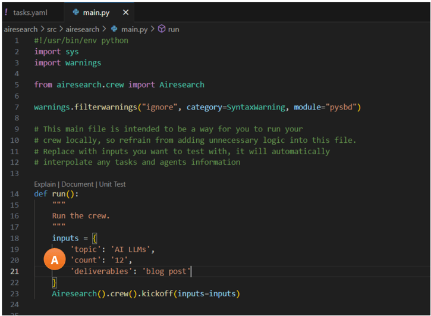
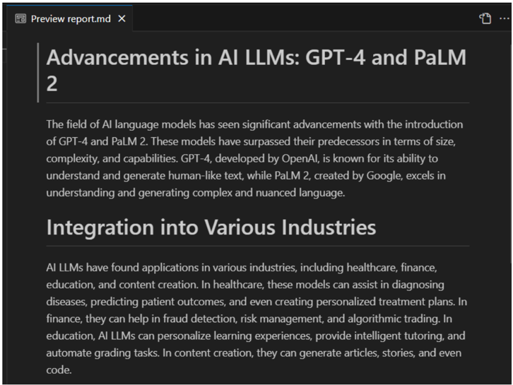
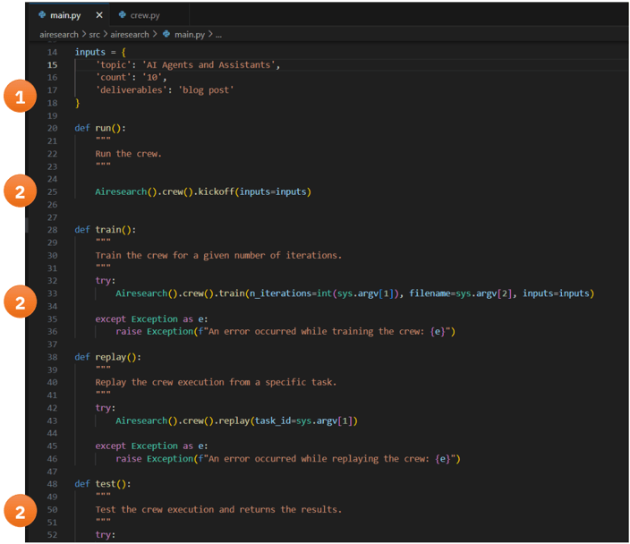
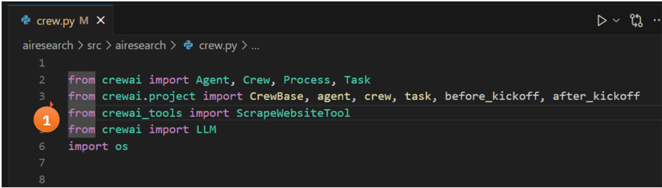
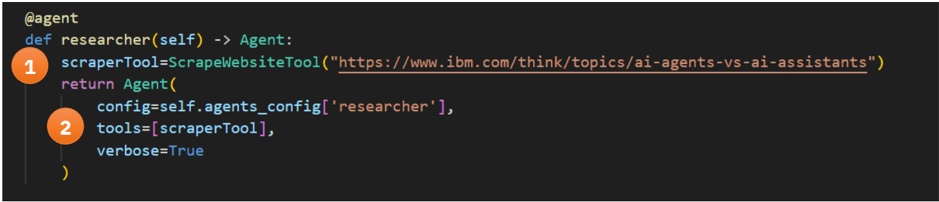
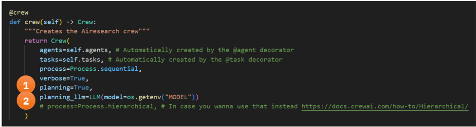

# Creating Agents with IBM watsonx.ai and Crew.ai

## Contents

- [Creating Agents with IBM watsonx.ai and Crew.ai](#creating-agents-with-ibm-watsonxai-and-crewai)
  - [Contents](#contents)
  - [1 Introduction](#1-introduction)
    - [1.1 Introduction to Crew.AI](#11-introduction-to-crewai)
    - [1.2 About this Lab](#12-about-this-lab)
    - [1.3 Product disclaimers](#13-product-disclaimers)
      - [1.3.1 Crew.ai Framework Changes](#131-crewai-framework-changes)
      - [1.3.2 Crew.ai Telemetry](#132-crewai-telemetry)
      - [1.3.3 watsonx.ai Product Enhancements](#133-watsonxai-product-enhancements)
  - [2 Prerequisites](#2-prerequisites)
    - [Software and Education](#software-and-education)
    - [Environment](#environment)
  - [3 Lab Preparation](#3-lab-preparation)
    - [3.1 Create the Development Environment](#31-create-the-development-environment)
      - [3.1.1 Project Folder](#311-project-folder)
      - [3.1.2 Python versions](#312-python-versions)
      - [3.1.1 Python Virtual Environment Tools](#311-python-virtual-environment-tools)
  - [4 Lab Exercise 1: A Crew of Two Agents](#4-lab-exercise-1-a-crew-of-two-agents)
    - [4.1 Setup](#41-setup)
      - [4.1.1 Install the framework](#411-install-the-framework)
      - [4.1.2 Gather the watsonx.ai API information](#412-gather-the-watsonxai-api-information)
      - [4.1.3 Use crew.ai's command-line tool to create a project](#413-use-crewais-command-line-tool-to-create-a-project)
      - [4.1.4 Update the .env File](#414-update-the-env-file)
      - [4.1.5 Project Package Installation](#415-project-package-installation)
    - [4.2 Run](#42-run)
    - [4.3 Observe](#43-observe)
      - [4.3.1 Results](#431-results)
    - [4.4 Reflect](#44-reflect)
  - [5 Lab Exercise 2: Passing Values to Agents with Variables](#5-lab-exercise-2-passing-values-to-agents-with-variables)
    - [5.1 Setup](#51-setup)
      - [5.1.1 Create New Variables](#511-create-new-variables)
      - [5.1.2 Define the Variables](#512-define-the-variables)
    - [5.2 Run](#52-run)
    - [5.3 Observe](#53-observe)
    - [5.4 Reflect](#54-reflect)
  - [6 Lab Exercise 3: Tool Calling](#6-lab-exercise-3-tool-calling)
  - [Notice](#notice)
    - [6.1 Setup](#61-setup)
      - [6.1.1 Change the Research Topic](#611-change-the-research-topic)
      - [6.1.2 Add and configure the `ScrapeWebsiteTool`](#612-add-and-configure-the-scrapewebsitetool)
      - [6.1.3 Enable Planning](#613-enable-planning)
    - [6.2 Run](#62-run)
    - [6.3 Observe](#63-observe)
    - [6.4 Reflect](#64-reflect)
  - [8 Lab Exercise Reflections](#8-lab-exercise-reflections)
    - [8.1 Lab Exercise 1 Reflection - Answers](#81-lab-exercise-1-reflection---answers)
      - [8.1.1 What components make up the default research crew? How do the agents work together?](#811-what-components-make-up-the-default-research-crew-how-do-the-agents-work-together)
      - [8.1.2 Why does the framework use sequential processing in this example? What other processing patterns might be possible?](#812-why-does-the-framework-use-sequential-processing-in-this-example-what-other-processing-patterns-might-be-possible)
      - [8.1.3 Examine the content in the report.md file -can you identify which parts were generated by each agent? How did they build upon each other's work?](#813-examine-the-content-in-the-reportmd-file--can-you-identify-which-parts-were-generated-by-each-agent-how-did-they-build-upon-each-others-work)
      - [8.1.4 What are the limitations of this basic implementation? Where is the agents' knowledge coming from?](#814-what-are-the-limitations-of-this-basic-implementation-where-is-the-agents-knowledge-coming-from)
    - [8.2 Lab Exercise 2 Reflection -Answers](#82-lab-exercise-2-reflection--answers)
      - [8.2.1 How does variable-passing change the flexibility of our agent system? What other variables might be useful to parameterize?](#821-how-does-variable-passing-change-the-flexibility-of-our-agent-system-what-other-variables-might-be-useful-to-parameterize)
      - [8.2.2 Compare the outputs from Exercise 1 and 2 -how did the changes in variables affect the agents' behavior and output?](#822-compare-the-outputs-from-exercise-1-and-2--how-did-the-changes-in-variables-affect-the-agents-behavior-and-output)
      - [8.2.3 What are the advantages and potential risks of using variables in agent prompts?](#823-what-are-the-advantages-and-potential-risks-of-using-variables-in-agent-prompts)
      - [8.2.4 Looking at the configuration files, how might you modify them to make the agents perform different kinds of research or analysis tasks?](#824-looking-at-the-configuration-files-how-might-you-modify-them-to-make-the-agents-perform-different-kinds-of-research-or-analysis-tasks)
    - [8.3 Lab Exercise 3 Reflection -Answers](#83-lab-exercise-3-reflection--answers)
      - [8.3.1 How does adding the web scraping tool change the quality and specificity of the agents' output?](#831-how-does-adding-the-web-scraping-tool-change-the-quality-and-specificity-of-the-agents-output)
      - [8.3.2 Examine the planning logs -how does the agent decide when to use its tools versus relying on its base knowledge?](#832-examine-the-planning-logs--how-does-the-agent-decide-when-to-use-its-tools-versus-relying-on-its-base-knowledge)
      - [8.3.3 What other types of tools might be useful to add to these agents? How would they enhance the agents' capabilities?](#833-what-other-types-of-tools-might-be-useful-to-add-to-these-agents-how-would-they-enhance-the-agents-capabilities)
      - [8.3.4 Why might we want to use local tools instead of external API services for this kind of functionality?](#834-why-might-we-want-to-use-local-tools-instead-of-external-api-services-for-this-kind-of-functionality)
  - [Conclusion](#conclusion)
    - [Key Takeways](#key-takeways)
  - [Credits](#credits)


## 1 Introduction

IBM watsonx.ai is a core component of watsonx, IBM's enterprise-ready AI and data platform that's designed to multiply the impact of AI across an enterprise.

The watsonx platform has three powerful components: the watsonx.ai studio for new foundation models, generative AI, and Machine Learning (traditional AI); the watsonx.data fit-for-purpose data lakehouse that provides the flexibility of a data lake with the performance of a data warehouse; and the watsonx.governance toolkit, which enables AI workflows that are built with responsibility, transparency, and explainability.


The watsonx.ai component (the focus of this lab) makes it possible for enterprises to train, validate, tune, and deploy AI models - both traditional AI and generative AI. With watsonx.ai, enterprises can leverage their existing traditional AI investment as well as exploit the innovations and potential of generative AI builds on foundation models to bring advanced automation and AI-infused applications to reduce cost, improve efficiency, scale, and accelerate the impact of AI across their organizations.

### 1.1 Introduction to Crew.AI

CrewAI is a Python framework for building multi-agent systems that help in use cases that require research automation, process automation, complex task management, and data analysis pipeline creation.

It focuses on collaboration between agents, and features:

- Multi-agent orchestration
- Process management
- Flexible tool integration

CrewAI defines the following key concepts:

- Agent: autonomous unit that can perform tasks, make decisions, use tools
- Crew: collaborative group of agents that achieve a set of tasks
- Process: workflow management system that defines collaboration patterns
- Task: all necessary details for execution, such as description, the agent responsible, required tools
- Tool:  skills or functions that agents can utilize to perform various actions

These components work together as follows:

- The Crew organizes the overall operation.
- The AI Agents work on their specialized tasks.
- The Process ensures smooth collaboration.
- The Tasks are completed to achieve the goal, and sometimes require Tools.

### 1.2 About this Lab

This lab provides hands-on experience developing AI agents using watsonx.ai and the crew.ai framework.

Each exercise builds upon the previous and must be performed in order starting with exercise 1.

### 1.3 Product disclaimers

#### 1.3.1 Crew.ai Framework Changes

The crew.ai framework is rapidly evolving.  At the time of this writing (March 2025) the recommended method of using codebase and details such as package managers are changing, and even some examples in crew.ai examples repo are deprecated and no longer work as expected.

Wherever possible, specific releases of the framework were referenced.

#### 1.3.2 Crew.ai Telemetry

By default, crew.ai gathers usage statistics.

An excerpt of https://docs.crewai.com/telemetry#telemetry, is partially included below.  This telemetry may be disabled by setting the environment variable OTEL\_SDK\_DISABLED to true .



#### 1.3.3 watsonx.ai Product Enhancements

This product is being developed and released in an agile manner. In addition to adding new capabilities, the interface is likely to change over time. Therefore, the screenshots used in this lab may not always look exactly like what you see in the product. Depending on the product, you can expect to encounter some of the following:

- Additional foundation models in the library list
- Additional foundation models available for prompt tuning
- Changes in the user interface (UI), such as the location of buttons or text in various fields
- Additional tabs or buttons

These differences should not affect how the labs work but have patience and explore.

However, there are some changes that can affect the results:

- Foundation models can be very sensitive to input. If you enter slightly different text than what the exercise is using (even if it is just a single word or a modified set of labeled data), the outcome can be different.
- There is ongoing tuning of the models. If the models themselves are updated, then some of the results may vary.

Please raise questions on the #data-ai-demo-feedback Slack channel (IBMers only). IBM partners can request help at the Partner Plus Support (https://www.ibm.com/partnerplus/support) website.

## 2 Prerequisites

### Software and Education

To complete this lab, familiarity with the following tools, languages, and products:

- Completion of IBM watsonx.ai Level 2
  - https://yourlearning.ibm.com/activity/PLAN-43433BB6E9CB
- Connectivity to:
  - IBM Cloud (https://cloud.ibm.com)
  - GitHub (https://github.com)
  - PyPi (https://pypi.org)
- Basic familiarity with Python 3:
  - Python Tutorial on python.org (https://docs.python.org/3.11/tutorial/index.html)
  - Python Programming (https://yourlearning.ibm.com/activity/URL-9219CDFC107D)
  - Intro to Python Open.Ed at University of Edinburgh (https://open.ed.ac.uk/introduction\_to\_python/)
- Visual Studio Code is used for all examples.
  - https://code.visualstudio.com/docs/introvideos/basics
- A development environment with Python 3.10, 3.11, or 3.12.
  - On Windows 10 or 11:
    - Tested with Python 3.11 from the Microsoft App Store https://apps.microsoft.com/detail/9NRWMJP3717K?hl=enus&amp;amp;gl=US&amp;amp;ocid=pdpshare
  - On MacOS Sequoia 15.2
    - Tested with the OS-provided Python 3.12.
  - On Linux / Ubuntu 22.04):
    - Tested with the OS-provided Python 3.10.

### Environment

You must have access to a watsonx.ai SaaS environment and an initialized project within that environment. If you do not have one already, it can be provisioned on [TechZone](https://techzone.ibm.com/collection/tech-zone-certified-base-images/journey-watsonx) by selecting the **watsonx.ai/.governance SaaS** environment and selecting **Education** as **Purpose**.

To run this lab, you will need:
- An [IBM Cloud API Key](https://cloud.ibm.com/iam/apikeys).
- Your watsonx.ai SaaS [URL and project ID](https://dataplatform.cloud.ibm.com/developer-access?context=wx).

## 3 Lab Preparation

### 3.1 Create the Development Environment

All lab development will be performed in a single Python project tree. The steps below should work on all platforms.

#### 3.1.1 Project Folder

To contain all the lab exercises, create a parent working folder:

```sh
mkdir crewai-lab
```

#### 3.1.2 Python versions

Crew.AI will run on python `3.10`, `3.11`, or `3.12`. This lab was tested developed on Python `3.12`. To see if you are running a compatible python interpreter, run:

```sh
python --version
```

#### 3.1.1 Python Virtual Environment Tools

All development should be done within a virtual environment to avoid affecting system packages.

```
python -m venv --help
```

## 4 Lab Exercise 1: A Crew of Two Agents

This exercise will introduce working with the crew.ai framework, through a simple example that uses two Agents.

### 4.1 Setup

Let's begin by installing the framework and creating an initial project.

#### 4.1.1 Install the framework

- Move to the lab folder

```sh
cd crewai-lab
```

- Create a virtual environment and enter a shell for the environment.

```sh
python -m venv .venv
source .venv/bin/activate
```

- Install the specified versions of `crewai` and `crewai-tools` packages.
  - **Note**: these frameworks evolve quickly and only the specified versions have been tested!

```sh
pip install 'crewai[tools]==0.102.0'
```

- Check the version installed.

```sh
crewai version
```

#### 4.1.2 Gather the watsonx.ai API information

Before proceeding further, gather your watsonx.ai project ID, API URL, and API key created during Step 3.

#### 4.1.3 Use crew.ai's command-line tool to create a project

The crew.ai framework includes a tool to bootstrap new projects.  By default, this tool creates agents that generate research reports about AI. Our lab will begin with that.

- Create a new agent called **airesearch** using the crew.ai CLI tool.

```sh
crewai create crew airesearch
```

- Select `7. watson` as the provider , and the `8. watsonx/ibm/granite-3-8b-instruct` model.
  - Enter your `WATSONX URL`.
  - Enter your `WATSONX API key`.
  - Enter your `WATSONX PROJECT ID`.

- Crew.ai will complete the setup.

#### 4.1.4 Update the .env File

Due to a defect in LiteLLM v1.58 (https://github.com/BerriAI/litellm/issues/7595), a manual update to the .env file is needed to communicate with the watsonx.ai API.

- Move to the directory the crew.ai cli created with the agent:

```sh
cd airesearch
```

- Open `.env` in your preferred editor.
- Duplicate the line with the variable `WATSONX_APIKEY`
- Rename the new variable `WATSONX_API_KEY`, including the second underscore.
- Save.

Example:
```
MODEL=watsonx/ibm/granite-3-8b-instruct
WATSONX_URL=https://eu-de.ml.cloud.ibm.com
WATSONX_APIKEY=aaaaaa-REDACTED-zzzzzz
WATSONX_API_KEY=aaaaaa-REDACTED-zzzzzz
WATSONX_PROJECT_ID=aaaaaa-REDACTED-zzzzzz
```

#### 4.1.5 Project Package Installation

Install project's pre-requisite packages, from within the project:

```sh
crewai install
```

Note: The results above are truncated.

### 4.2 Run

Run the Crew with the default configuration.

- Run the agent  using the crew.ai CLI tool.

```sh
crewai run
```

### 4.3 Observe

#### 4.3.1 Results

The results of execution are somewhat long and likely scrolled past your screen; however the final report was saved in a markdown file named `report.md`.

- Open `report.md` in VSCode, and preview results:

**Note**: The results shown are truncated.



### 4.4 Reflect

Check your understanding by considering the following questions:

- What components make up the default research crew? How do the agents work together?
- Why does the framework use sequential processing in this example? What other processing patterns might be possible?
- Examine the content in the report.md file - can you identify which parts were generated by each agent? How did they build upon each other's work?
- What are the limitations of this basic implementation? Where is the agents' knowledge coming from?

Responses to these questions may be found in the section Lab Exercise Reflections.

## 5 Lab Exercise 2: Passing Values to Agents with Variables

This exercise must be completed after exercise 1.

This exercise continues exercise 1 to illustrate how values may be dynamically passed to Agents and Tasks using variables.

In this scenario, we will use variables to dynamically change the topic researched, the volume of research data, and the format of the output.

### 5.1 Setup

#### 5.1.1 Create New Variables

- Move to the folder `airesearch/src/airesearch`
- Open the two configuration yaml files:
  - `config/agents.yaml`
  - `config/tasks.yaml`
- Review the files and note that the instructions use `{topic}` instead of specifying the subject to research.



- In `tasks.yaml` , replace `10` with `{count}`
- In `agents.yaml` and `tasks.yaml` replace `reports` and `a report` with `{deliverables}`



#### 5.1.2 Define the Variables
- Open `main.py` and locate the `run()` method.
- Expand the `inputs` Dictionary with values for the new variables. See (A).
- Optional alternative: Instead of defining the variables in `main.py`, values can be populated via hook. See the new `@before_kickoff` block annotation in `crew.py`.



### 5.2 Run

- Run the crew again using the crew.ai CLI.

```sh
crewai run
```

### 5.3 Observe
The generated output was saved in a markdown file named `report.md`.

- Open `report.md` in VSCode, and preview results. Note the changes to the flow of the results.



### 5.4 Reflect

Check your understanding by considering the following questions:

- How does variable-passing change the flexibility of our agent system? What other variables might be useful to parameterize?
- Compare the outputs from Exercise 1 and 2 - how did the changes in variables affect the agents' behavior and output?
- What are the advantages and potential risks of using variables in agent prompts?
- Looking at the configuration files, how might you modify them to make the agents perform different kinds of research or analysis tasks?

Responses to these questions may be found in the section Lab Exercise Reflections.
## 6 Lab Exercise 3: Tool Calling

This lab must be completed after Exercise 2.

The questions at the end of the last exercise hint to where the Agents source data:  they have no tools, and there is no RAG data source, so all responses must come from either the prompt or the base model!

We can expand the knowledgebase and capabilities of Agents by implementing tool calling.

Crew.ai provides a framework for easily adding tools Agents can use to complete tasks. In this exercise, we will direct the agent to answer questions from a specific data source.

## Notice

The crew.ai site provides examples of web search and site scraping tool integrations.  These rely upon SaaS services which are either rate-limited or require payment.  To avoid those constraints, this lab uses a locally hosted tool to scrape a single web page.

### 6.1 Setup

Make the following modifications to the code. The packages referenced were previously installed by the `crewai-tools` package.

#### 6.1.1 Change the Research Topic

First, change the research topic to something not contained in the base model, so the results will clearly show whether the response was generated from material provided by the tool. Update `main.py` as follows:

- Move the inputs from the `run()` method to a global variable, change the topic to `AI Agents and Assistants` , and reduce the count of items from `12` to `10`. (1)
- Update the `run`, `train`, and `test` methods (2) to remove local inputs, so that they use the new global inputs. **Note**: the train and test methods are not used in this lab.



#### 6.1.2 Add and configure the `ScrapeWebsiteTool`

Make the following changes to the `crew.py` file:

- At the top of the file, import the `ScrapeWebsiteTool` tool, and import LLM from crew.ai (1).




- In the researcher agent method, instantiate a `ScrapeWebsiteTool` with the URL https://www.ibm.com/think/topics/ai-agents-vs-ai-assistants (1), and pass the new tool to the Agent (2).



#### 6.1.3 Enable Planning

To determine when to call the tools, the Crew needs to perform planning first.

- Modify the crew method to enabling planning (1) and specifying that planning should be performed with the same model used for inferencing (2), as specified by MODEL environment variable.



### 6.2 Run

- Run the crew again using the crew.ai CLI.

```
crewai run
```

### 6.3 Observe

Once again generated blog post was saved in a markdown file named report.md.  Open report.md in VSCode, and preview results.

Note the changes to result contents.

### 6.4 Reflect

Check your understanding by considering the following questions:

Creating Agents with IBM watsonx.ai and crew.ai

- How does adding the web scraping tool change the quality and specificity of the agents' output?
- Examine the planning logs -how does the agent decide when to use its tools versus relying on its base knowledge?
- What other types of tools might be useful to add to these agents? How would they enhance the agents' capabilities?
- Why might we want to use local tools instead of external API services for this kind of functionality?

Responses to these questions may be found in the section Lab Exercise Reflections.

## 8 Lab Exercise Reflections

### 8.1 Lab Exercise 1 Reflection - Answers

#### 8.1.1 What components make up the default research crew? How do the agents work together?

An "AI LLMs Senior Data Researcher" agent responsible for conducting initial research. A "Topic Reporting Analyst" agent that processes the research and creates the final report These agents work in sequence, with the researcher's output feeding into the analyst's work.

#### 8.1.2 Why does the framework use sequential processing in this example? What other processing patterns might be possible?

The reporting analyst needs the researcher's findings to create the report. It provides a clear workflow where each agent has a defined role and order. Other possible patterns include:

- Parallel processing where multiple agents work simultaneously on different aspects
- Hierarchical processing where a manager agent coordinates multiple worker agents
- Iterative processing where agents can cycle back for additional research/refinement

#### 8.1.3 Examine the content in the report.md file -can you identify which parts were generated by each agent? How did they build upon each other's work?

The researcher agent generates the raw research findings including key points, trends, and technical details. The reporting analyst takes these findings and structures them into a coherent report with proper formatting, transitions, and a consistent narrative flow

#### 8.1.4 What are the limitations of this basic implementation? Where is the agents' knowledge coming from?

These agents can only work from the knowledge provided. In this scenario, knowledge is limited to what is in the LLM's training data. There is no access to current or real-time information, and no ability to verify or fact-check information, because there are no external data sources or tools are provided.

### 8.2 Lab Exercise 2 Reflection -Answers

#### 8.2.1 How does variable-passing change the flexibility of our agent system? What other variables might be useful to parameterize?

Variable passing enables:

- Dynamic modification of research topics without changing code
- Customization of output format and depth
- Adaptation of agent behavior without restructuring.

Additional useful variables might include:

- Time period for research focus
- Technical depth level
- Target audience
- Output language
- Sources to include/exclude

#### 8.2.2 Compare the outputs from Exercise 1 and 2 -how did the changes in variables affect the agents' behavior and output?

The variable changes affected:

- The scope and depth of research based on the count parameter
- The format and structure based on the ' deliverables  parameter '
- The focus and specificity of content based on the topic parameter
- The overall length and detail level of the output.

#### 8.2.3 What are the advantages and potential risks of using variables in agent prompts?

Advantages:

- Increased flexibility and reusability
- Easy customization for different use cases
- Consistent structure with varying content.

Risks:

- Potential for prompt injection if variables aren't properly sanitized
- Risk of inconsistent output if variables contain unexpected values
- Possible degradation of agent performance with extreme variable values

#### 8.2.4 Looking at the configuration files, how might you modify them to make the agents perform different kinds of research or analysis tasks?

- Adjust agent roles and expertise in agents.yaml
- Modify task descriptions and goals in tasks.yaml
- Add new variables for different analysis parameters
- Change the sequence or relationship between agents
- Add validation or specific requirements for outputs

### 8.3 Lab Exercise 3 Reflection -Answers

#### 8.3.1 How does adding the web scraping tool change the quality and specificity of the agents' output?

- Provides access to current and specific information
- Enables fact-checking and verification
- Allows citation of specific sources
- Improves accuracy for technical or domain-specific content
- Makes outputs more grounded in real data rather than model knowledge

#### 8.3.2 Examine the planning logs -how does the agent decide when to use its tools versus relying on its base knowledge?

The agent's decision-making process:

- Uses planning to evaluate information needs
- Considers tool capabilities against task requirements
- May use base knowledge for general concepts and context
- Uses tools for specific facts, current information, or verification
- Combines tool-sourced information with base knowledge for comprehensive answers

#### 8.3.3 What other types of tools might be useful to add to these agents? How would they enhance the agents' capabilities?

- Database querying tools for structured data analysis
- API integration tools for real-time data
- File system tools for local document analysis
- Calculation tools for numerical analysis
- Visualization tools for data presentation These would enhance the agents' ability to work with different data types and perform more complex analyses.

#### 8.3.4 Why might we want to use local tools instead of external API services for this kind of functionality?

- Better control over data privacy and security
- No rate limiting or usage costs
- Faster response times
- More reliable operation
- Easier debugging and customization
- No dependency on external service availability

## Conclusion

This lab has provided hands-on experience with developing AI agents using IBM watsonx.ai and the crew.ai framework. Through a series of exercises, we have explored the capabilities of these tools and how they can be used to create complex agent systems.

### Key Takeways

* The crew.ai framework provides a flexible and powerful way to build multi-agent systems, with features such as multi-agent orchestration, process management, and flexible tool integration.
* IBM watsonx.ai is a core component of the watsonx platform, providing a range of AI and machine learning capabilities, foundation models, generative AI, and traditional AI.
* The combination of crew.ai and watsonx.ai enables the creation of sophisticated agent systems that can perform complex tasks, such as research and analysis.
* The use of variables and tools can enhance the flexibility and capabilities of agent systems, allowing for dynamic modification behavior and access to external data sources.

## Credits

**Original Lab:**

Brian Bissell
WW Delivery Practice Leader, Generative AI and Assistants
IBM Technology Expert Labs
bbissell@us.ibm.com

**Edited by:**

Noe Samaille
AI Engineer, EMEA watsonx
IBM Client Engineering
noe.samaille@ibm.com

End of document.
