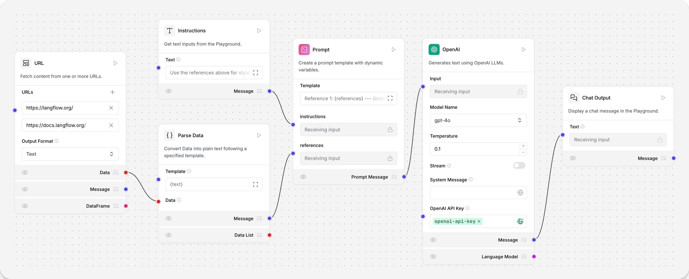
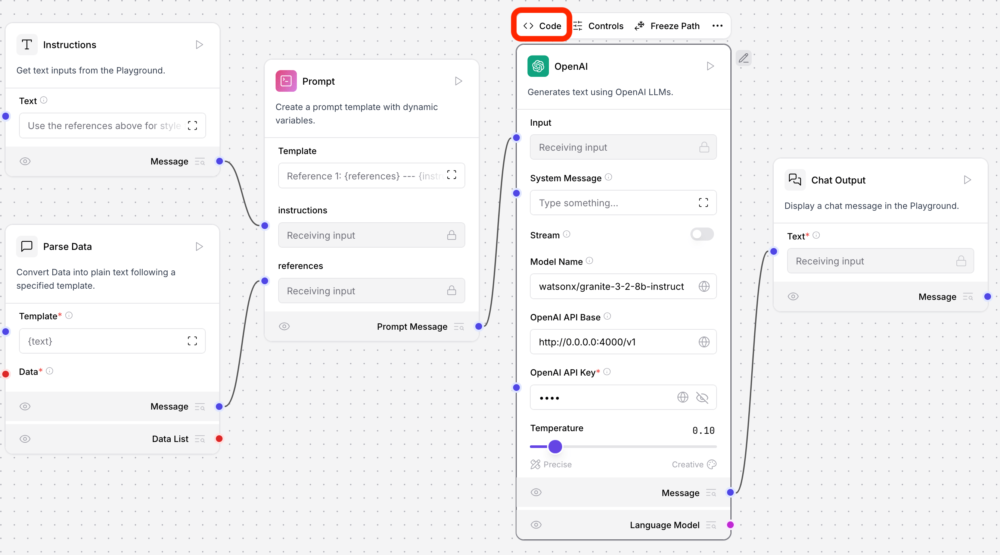
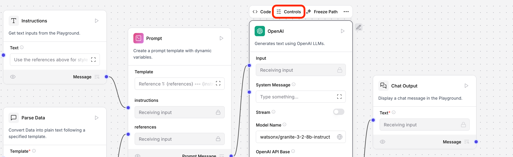
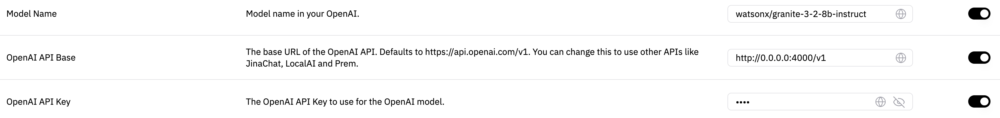

# Getting started with LangFlow and IBM watsonx.ai

In this lab, we will build a Blog Writer flow for a one-shot application using watsonx.ai and Granite.



This flow extends the Basic Prompting flow with the **URL** and **Parse data** components that fetch content from multiple URLs and convert the loaded data into plain text.

Granite uses this loaded data to generate a blog post, as instructed by the **Text input** component.

## Contents

- [Getting started with LangFlow and IBM watsonx.ai](#getting-started-with-langflow-and-ibm-watsonxai)
  - [Contents](#contents)
  - [Prerequisites](#prerequisites)
  - [Deploy LiteLLM proxy](#deploy-litellm-proxy)
    - [References](#references)
  - [Create the blog writer flow](#create-the-blog-writer-flow)
    - [Run the blog writer flow](#run-the-blog-writer-flow)
  - [Conclusion](#conclusion)

## Prerequisites

- Langflow [installed and running](https://docs.langflow.org/get-started-installation).
- Container runtime like [Podman Desktop](https://podman-desktop.io/downloads) (with `docker` compatibility) or [Rancher Desktop](https://rancherdesktop.io/).
- watsonx.ai [URL, Project ID, and API key](https://dataplatform.cloud.ibm.com/developer-access)

## Deploy LiteLLM proxy

**Disclaimer**: This part is temporarily needed to hit watsonx.ai through an OpenAI compatible API proxy (LiteLLM proxy server does just that) until watsonx.ai is available as a provider within LangFlow.

1. Open a terminal that will be dedicated to running liteLLM proxy server.
2. Configure environment variables:
    ```sh
    export WATSONX_URL=""
    export WATSONX_API_KEY=""
    export WATSONX_PROJECT_ID=""
    ```
3. Create your LiteLLM configuration file, `litellm_config.yaml`:
    ```sh
    model_list:
    - model_name: watsonx/granite-3-8b-instruct
        litellm_params:
        model: watsonx/ibm/granite-3-8b-instruct
    ```
4. Start the proxy:
    ```sh
    docker run \
        -v $(pwd)/litellm_config.yaml:/app/config.yaml \
        -e WATSONX_URL=$WATSONX_URL \
        -e WATSONX_API_KEY=$WATSONX_API_KEY \
        -e WATSONX_PROJECT_ID=$WATSONX_PROJECT_ID \
        -p 4000:4000 \
        ghcr.io/berriai/litellm:main-latest \
        --config /app/config.yaml --detailed_debug
    ```
5. You can validate that the proxy is running by listing available models at [localhost:4000/v1/models](http://localhost:4000/v1/models). Expected output:
    ```json
    {
        "data": [
            {
                "id": "watsonx/granite-3-2-8b-instruct",
                "object": "model",
                "created": 1677610602,
                "owned_by": "openai"
            }
        ],
        "object": "list"
    }
    ```

### References

- [LiteLLM proxy](https://docs.litellm.ai/docs/proxy/docker_quick_start) quickstart.
- [LiteLLM proxy for watsonx](https://docs.litellm.ai/docs/providers/watsonx).

## Create the blog writer flow

1. From the Langflow dashboard (default endpoint is [127.0.0.1:7860](http://127.0.0.1:7860)), click **New Flow**.
2. Select **Blog Writer**.
3. The **Blog Writer** flow is created.
    
4. Update the OpenAI component's **code** with `model_name` parameter being a text input not a select, then click **Save**:
    
    - **Note**: `model_name` parameter should look like this:
        ```
        ...OMITTED...
        BoolInput(
            name="json_mode",
            display_name="JSON Mode",
            advanced=True,
            info="If True, it will output JSON regardless of passing a schema.",
        ),
        StrInput(
            name="model_name",
            display_name="Model Name",
            advanced=True,
            info="Model name in your OpenAI.",
        ),
        StrInput(
            name="openai_api_base",
            display_name="OpenAI API Base",
            advanced=True,
            info="The base URL of the OpenAI API. "
            "Defaults to https://api.openai.com/v1. "
            "You can change this to use other APIs like JinaChat, LocalAI and Prem.",
        ),
        ...OMITTED...
        ```
5. Update the OpenAI component's **controls** with your LiteLLM proxy endpoint:
    
    - **Model Name**: `watsonx/granite-3-2-8b-instruct`
    - **OpenAI API Base**: `http://0.0.0.0:4000/v1`
    - **OpenAI API Key**: `1234`
        

This flow creates a one-shot article generator with **Prompt**, **OpenAI**, and **Chat Output** components, augmented with reference content and instructions from the **URL** and **Text Input** components.

The **URL** component extracts raw text and metadata from one or more web links.
The **Parse Data** component converts the data coming from the **URL** component into plain text to feed the prompt.

To examine the flow's prompt, click the **Template** field of the **Prompt** component.

```plain
Reference 1:

{references}

---

{instructions}

Blog:
```

The `{instructions}` value is received from the **Text input** component, and one or more `{references}` are received from a list of URLs parsed from the **URL** component.


### Run the blog writer flow

1. Click the **Playground** button. Here you can chat with the AI that has access to the **URL** content.
2. Click the **Lighting Bolt** icon to run it.
3. To write about something different, change the values in the **URL** component and adjust the instructions on the left side bar of the **Playground**. Try again and see what the LLM constructs.

## Conclusion
In this lab, we successfully integrated LangFlow with IBM watsonx.ai to create a Blog Writer flow. The flow utilizes the LiteLLM proxy to interact with the watsonx.ai API, enabling the use of the Granite model for generating blog posts. 

The key outcomes of this lab include:
* Deploying the LiteLLM proxy server to facilitate communication between LangFlow and watsonx.ai
* Creating a Blog Writer flow in LangFlow that leverages the OpenAI component with the LiteLLM proxy endpoint
* Configuring the flow to extract reference content from URLs and it into plain text for the prompt
* Running the flow and generating a blog post based on the provided instructions and reference content

By completing this lab, you have demonstrated the ability to integrate LangFlow with external AI models and APIs, and to create custom flows for specific use cases. This skill can be to a wide range of applications, from content generation to data analysis and more. 
