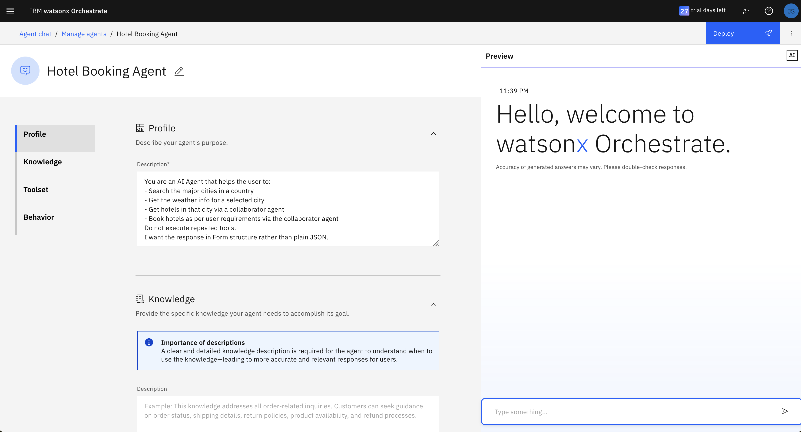
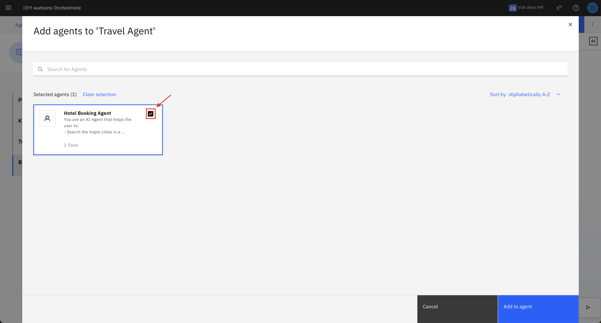
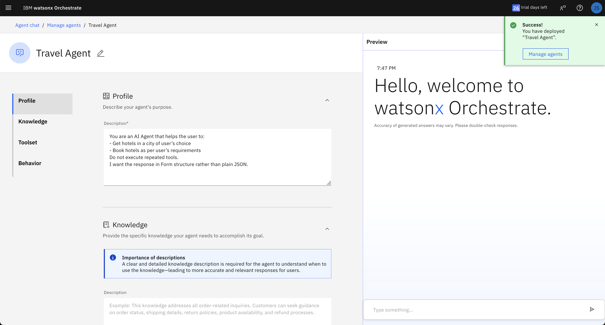
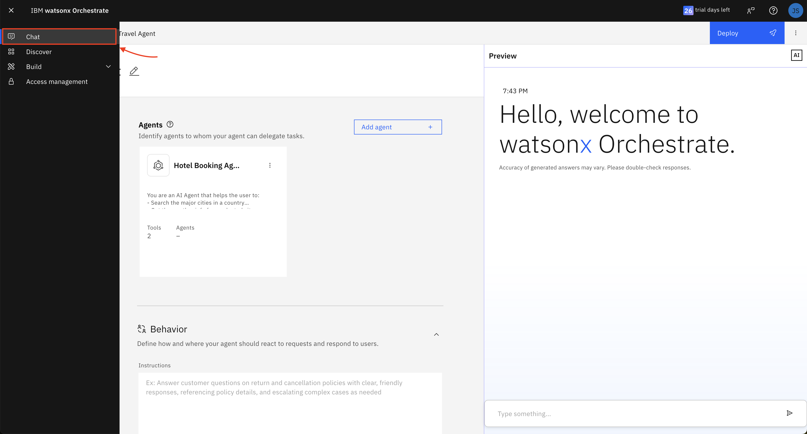

# Hands-on Lab: watsonx.Orchestrate Travel & Hotel Booking Agent

## Introduction

In this hands-on lab, you will learn how to build agentic workflows using watsonx.Orchestrate, a powerful tool for creating custom AI-powered agents. You will follow the story of a traveller who is planning their upcoming vacation.

###  📌 Getting Started

#### Launch **watsonx.Orchestrate**

Navigate to the [Attendee URL](https://techzone.ibm.com/my/workshops/student/681a3aba796fbe5a44f84c30) to get your environment details for **watsonx.Orchestrate** and click `Launch watsonx Orchestrate`.


This will launch the **watsonx.Orchestrate** Main Page.

### Part 1: Create the Hotel Booking Agent

### 1. Click **Create new agent**


### 2. Select **Create from scratch**  
   - Name: `Hotel Booking Agent`  
   - Description:
     ```
     You are an AI Agent that helps the user to:
     - Search the major cities in a country
     - Get the weather info for a selected city
     - Get hotels in that city via a collaborator agent
     - Book hotels as per user requirements via the collaborator agent
     Do not execute repeated tools.
     I want the response in Form structure rather than plain JSON.
     ```

### 3. Click **Create**



### 4. Now lets give our agent access to some tools to help it accomplish tasks. We'll be using OpenAPI specification files to define API tools for our agents.

Navigate to **Toolset** → click **Add tool**

### 5. Select **Import an external too**l**. and upload

   - [`list_hotels_location.json`](./hotel-booking-agent/tools/list_hotels_location.json)
   Check the Operation (*POST - Get list of hotels in a city*) and Click **Done**.

   This tools allows the agent to: \
    - Understand **when** to use this tool (e.g. when user says "Find hotels in Riyadh") \
    - Know **what input to collect** (`city`) \
    - Know **how to call the API** (`POST` to /`list-hotels` with JSON body) \
    - Know **how to parse the result** (hotel `names`, `rates`, etc.)


### 6. Repeat this step to add a second tool:  
   - [`hotel_booking_confirmation.json`](./hotel-booking-agent/tools/hotel_booking_confirmation.json)
   Check the Operation (*POST - Confirm hotel booking*) and Click **Done**.

   This tools allows the agent to: \
    - When to** use this tool** (e.g. after user says “`Book this hotel from July 1 to July 4`”) \
    - What **input fields** to collect \
    - How to **call the endpoint** with structured `JSON` \
    - What kind of **response to interpret** and **how to use it** (e.g. display `confirmation_id`) \
    - How to **handle errors** (e.g. bad date range)


### 7. Test with a sample prompt:  
   `"Provide me the best hotels in Riyadh"`


### 8. Click **Deploy** to publish the agent and make it available for the Orchestrator Agent to utilise.

---
### Part 2: Create the Travel Agent

1. Repeat previous steps to create another agent:  
   - Name: `Travel Agent`
   - Description:
     ```
     You are an AI Agent that helps the user to:
     - Get hotels in a city of user’s choice
     - Book hotels as per user’s requirements
     Do not execute repeated tools.
     I want the response in Form structure rather than plain JSON.
     ```

2. Now lets give our agent access to some tools to help it accomplish tasks. We'll be using OpenAPI specification files to define API tools for our agents.
   - [`Country_code.JSON`](./travel-agent/tools/country_code.json) - The agent uses this tool to retrieve the **ISO country code** (e.g. "`US`" for the United States) based on a user-provided country name. This will be used as a lookup step to feed other APIs requiring a country code.

   - [`cities_api.json`](./travel-agent/tools/cities_api.json) - The agent calls this tool to get a list of **major cities** within a specified country or region.

   - [`Country_info.JSON`](./travel-agent/tools/Country_info.JSON) - This tool gives the agent** general information** about a country, such as **population**, **capital**, **area**, and **currency**. It’s used when a user asks questions like “Tell me about Spain” or “What’s the capital of Brazil?”.

   - [`weather_info_demo.json`](./travel-agent/tools/weather_info_demo.json) - The agent uses this to provide **current weather** conditions (`temperature`, `humidity`, etc.) for a specific city. It's best suited for answering user prompts like “*What’s the weather in Rome right now?*”

   - [`weather_forecast_week.json`](./travel-agent/tools/weather_forecast_week.json) - This tool returns a **7-day weather forecast** for a given city. The agent uses it to respond to queries like “*What’s the weather like in Tokyo this week?*” to support travel planning tasks.

3. Let's test with sample prompts:
   - What are the major cities in Saudi?
   - What's the weather like in Riyadh?
   - How about for the next week?


4. Next, let's add a **Knowledge Base** to our Travel Agent:

**Knowledge bases** will ensure our Agent's responses are grounded in factual information. It reduces reliance on the model's memory alone and helps prevent hallucinations or vague answers. 

With access to structured or curated **domain knowledge**, the agent can provided tailored assistance.

To add the following documents files as knowledge, click **Upload Files**:
   - `City Info.xlsx`
   - `Flight Booking Tips for Smart Travelers.docx`
   - `General Travel Information for International Travelers.docx`


Then add a description for the uploaded knowledge:
A clear and detailed knowledge description is required for the agent to understand when to use the knowledge—leading to more accurate and relevant responses for users.

```
Refer to the documentation
- when the user asks about the cities in a country OR
- when the user asks for best tips on flight booking or when asked some generic information about the travel
```

Optionally, modify the Knowledge Settings to customise how the Agent will utilise the knowledge documents:


---
### Part 3: Add the Hotel Booking Agent as a Collaborator Agent

Now let's add the **Hotel Booking Agent** we created earlier to the **Travel Agent** to extend its scope.

Under Agents, click `Add agent`:


Select `Add from local instance` to choose from a list of agents available:



Click `Add to agent`.

Great! The Hotel Booking Agent is now available to the Travel Agent for task delegation and collaboration.

---
### Part 4: Deploy & Test the Multi-Agent Collaboration via Chat

Click the top-right corner button `Deploy` the Travel Agent.



Fantasitc! The **Travel Agent** is now available to the Orchestrator Agent for task delegation.

Let's navigate to the `Chat`.



   - What are the major cities in Saudi?
   - What's the weather like in Riyadh today?
   - How about for the next week?
   - Cool. Provide me the best hotels there
   - Let's go with the cheapest one there, for 3 nights.
   - I will be travelling with my daughters