# Hands-on Lab: Travel & Hotel Booking Agent

## Introduction
In this hands-on lab, you will learn how to build agentic workflows using **watsonx.Orchestrate**, a powerful tool for creating custom AI-powered agents. You will follow the story of a traveller who is planning their upcoming vacation.

- [Part 1: Create the Hotel Booking Agent](#part-1-create-the-hotel-booking-agent)
- [Part 2: Create the Travel Agent](#part-2-create-the-travel-agent)
- [Part 3: Add the Hotel Booking Agent as a Collaborator](#part-3-add-the-hotel-booking-agent-as-a-collaborator)
- [Part 4: Deploy & Test the Multi-Agent Collaboration](#part-4-deploy--test-the-multi-agent-collaboration)

---

### 🔹 Launch watsonx.Orchestrate
1. Navigate to [IBM Cloud](https://cloud.ibm.com/resources)

Expand the `AI/Machine Learning` and select `Watson Orchestrate-itz`.

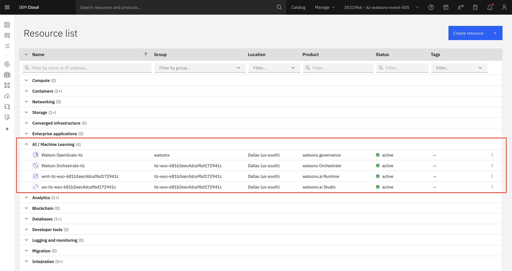

2. Click `Launch watsonx Orchestrate` to open the main page.

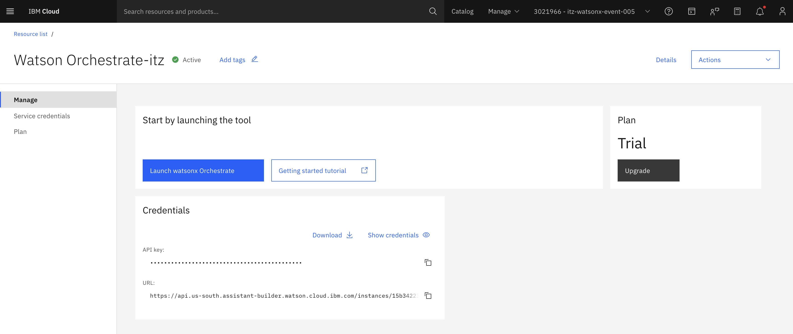

---

## Part 1: Create the Hotel Booking Agent

### 1. Create the Agent
- Click **Create new agent**
- Select **Create from scratch**
- Fill in:
  - **Name:** `Hotel Booking Agent`
  - **Description:**
    ```
    You are an AI Agent that helps the user to:
    - Search the major cities in a country
    - Get the weather info for a selected city
    - Get hotels in that city via a collaborator agent
    - Book hotels as per user requirements via the collaborator agent
    Do not execute repeated tools.
    I want the response in Form structure rather than plain JSON.
    ```
- Click **Create**

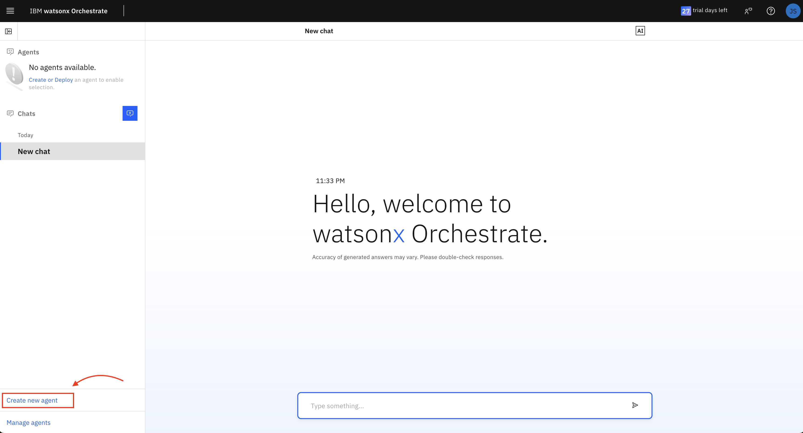

### 2. Now lets give our agent access to some tools to help it accomplish tasks. We'll be using OpenAPI specification files to define API tools for our agents.

### Tool 1: List Hotels in a City
- Navigate to **Toolset** → click **Add tool**
- Select **Import an external tool**
- Upload [`list_hotels_location.json`](./hotel-booking-agent/tools/list_hotels_location.json)
- Check the *POST - Get list of hotels in a city* operation
- Click **Done**

This tools allows the agent to:
- Understand **when** to use this tool (e.g. when user says "Find hotels in Riyadh") \
- Know **what input to collect** (`city`) \
- Know **how to call the API** (`POST` to /`list-hotels` with JSON body) \
- Know **how to parse the result** (hotel `names`, `rates`, etc.)

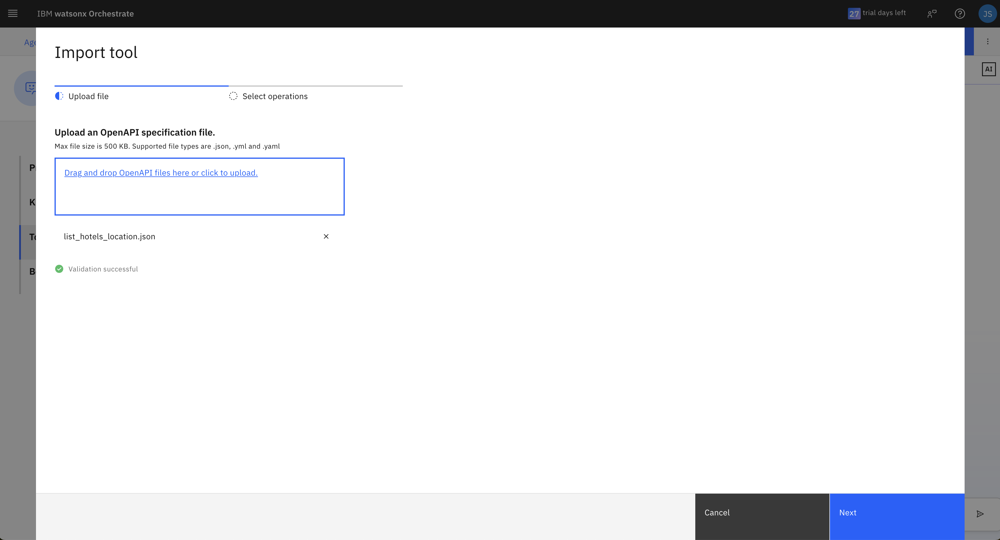

### Tool 2: Confirm Hotel Booking
- Upload [`hotel_booking_confirmation.json`](./hotel-booking-agent/tools/hotel_booking_confirmation.json)
- Check the *POST - Confirm hotel booking* operation
- Click **Done**

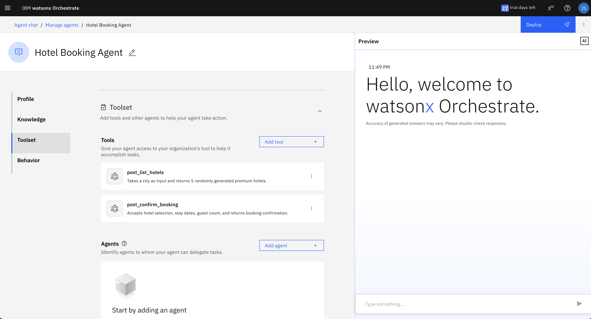

**Add a Behavior:**
```
When using the confirm-booking tool, make sure to use the following date format for the check_in and check_out dates: 2025-07-01.

Try to infer as much information as possible from the conversation to confirm hotel booking.
```

### 3. Test the Agent
Sample prompt: `"Provide me the best hotels in Riyadh"`

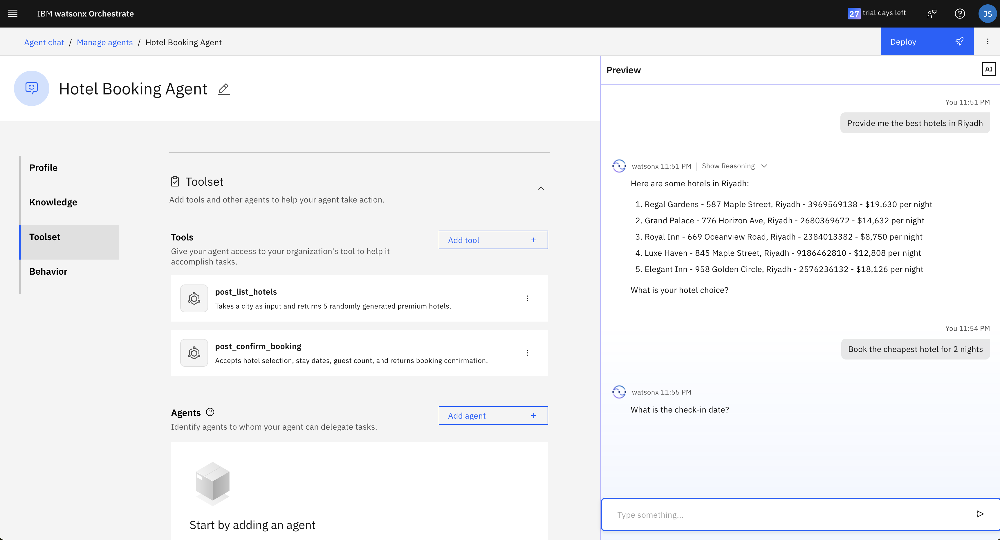

### 4. Deploy the Agent
Click **Deploy** to publish the agent for Orchestrator usage.

---

## Part 2: Create the Travel Agent

### 1. Create the Agent
- Repeat the steps above with:
  - **Name:** `Travel Agent`
  - **Description:**
    ```
    You are an AI Agent that helps the user to:
    - Get hotels in a city of user’s choice
    - Book hotels as per user’s requirements
    Do not execute repeated tools.
    I want the response in Form structure rather than plain JSON.
    ```

### 2. Now lets give our agent access to some tools to help it accomplish tasks. We'll be using OpenAPI specification files to define API tools for our agents.

   - [`Country_code.JSON`](./travel-agent/tools/country_code.json) - The agent uses this tool to retrieve the **ISO country code** (e.g. "`US`" for the United States) based on a user-provided country name. This will be used as a lookup step to feed other APIs requiring a country code.

   - [`cities_api.json`](./travel-agent/tools/cities_api.json) - The agent calls this tool to get a list of **major cities** within a specified country or region.

   - [`Country_info.JSON`](./travel-agent/tools/Country_info.JSON) - This tool gives the agent** general information** about a country, such as **population**, **capital**, **area**, and **currency**. It’s used when a user asks questions like “Tell me about Spain” or “What’s the capital of Brazil?”.

   - [`weather_info_demo.json`](./travel-agent/tools/weather_info_demo.json) - The agent uses this to provide **current weather** conditions (`temperature`, `humidity`, etc.) for a specific city. It's best suited for answering user prompts like “*What’s the weather in Rome right now?*”

   - [`weather_forecast_week.json`](./travel-agent/tools/weather_forecast_week.json) - This tool returns a **7-day weather forecast** for a given city. The agent uses it to respond to queries like “*What’s the weather like in Tokyo this week?*” to support travel planning tasks.

### 3. Test the Agent
Try prompts like:
- `What are the major cities in Saudi?`
- `What's the weather like in Riyadh?`
- `How about for the next week?`

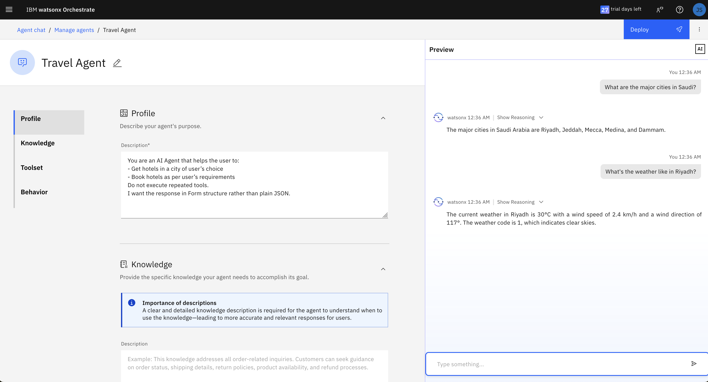

### 4. Next, let's add a **Knowledge Base** to our Travel Agent:

**Knowledge bases** will ensure our Agent's responses are grounded in factual information. It reduces reliance on the model's memory alone and helps prevent hallucinations or vague answers. 

With access to structured or curated **domain knowledge**, the agent can provided tailored assistance.

Click **Upload Files** and add:
- `City Info.xlsx`
- `Flight Booking Tips for Smart Travelers.docx`
- `General Travel Information for International Travelers.docx`

#### Knowledge Description:
```
Refer to the documentation:
- when the user asks about the cities in a country OR
- when the user asks for best tips on flight booking or when asked some generic information about the travel
```

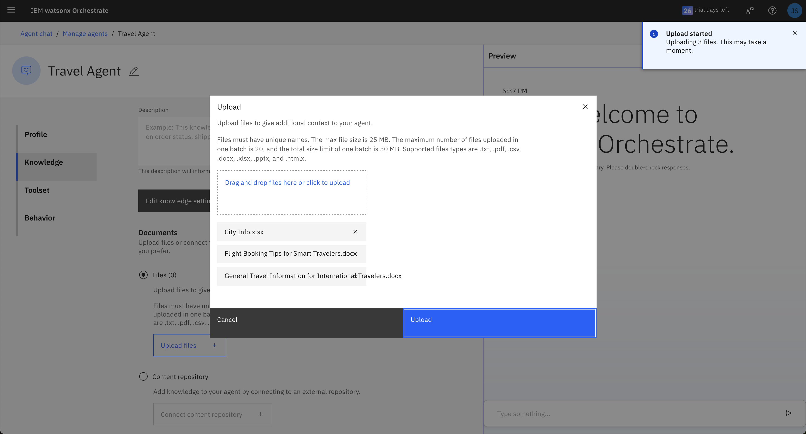

Optionally adjust **Knowledge Settings** to control how the agent uses the uploaded files.

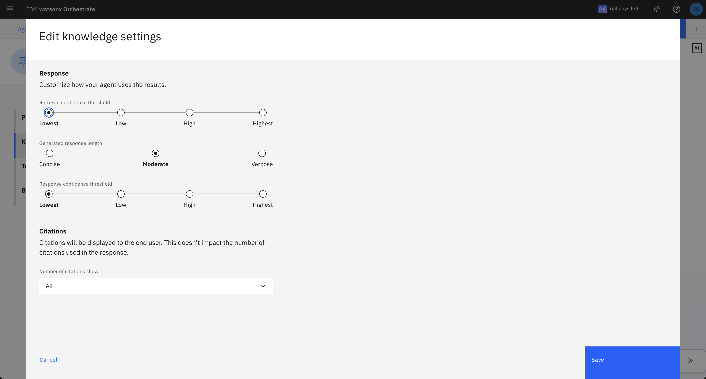

---

## Part 3: Add the Hotel Booking Agent as a Collaborator

1. Under **Agents**, click `Add agent`
2. Select `Add from local instance`
3. Choose `Hotel Booking Agent`
4. Click `Add to agent`

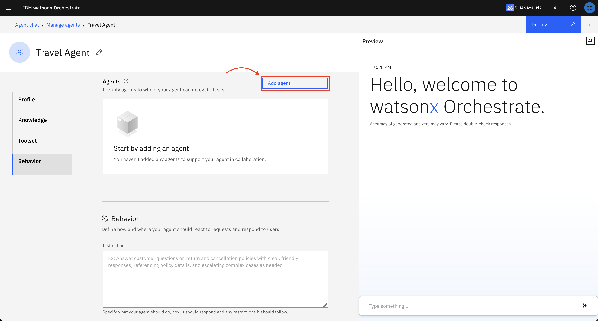

The Travel Agent can now delegate hotel booking tasks to the Hotel Booking Agent.

---

## Part 4: Deploy & Test the Multi-Agent Collaboration

1. Click **Deploy** on the Travel Agent
2. Navigate to **Chat** and try prompts such as:
   - `What are the major cities in Saudi?`
   - `What's the weather like in Riyadh today?`
   - `How about for the next week?`
   - `Cool. Provide me the best hotels there`
   - `Let's go with the cheapest one there, for 3 nights.`
   - `I will be travelling with my daughters`

Expand **Show Reasoning** to inspect how tools and agents were used.

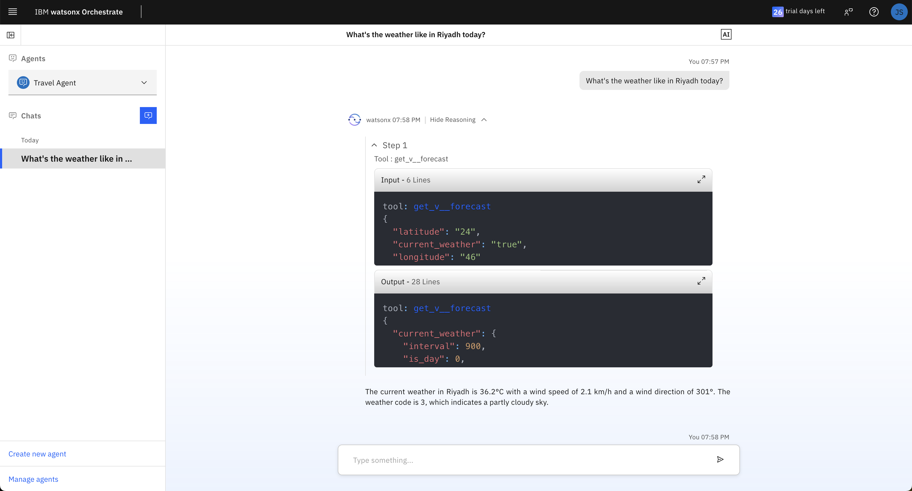
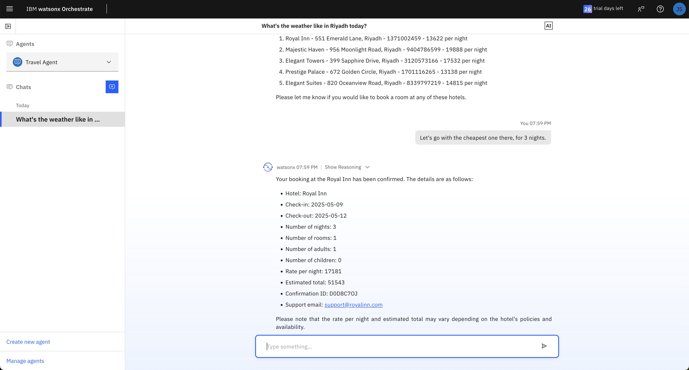
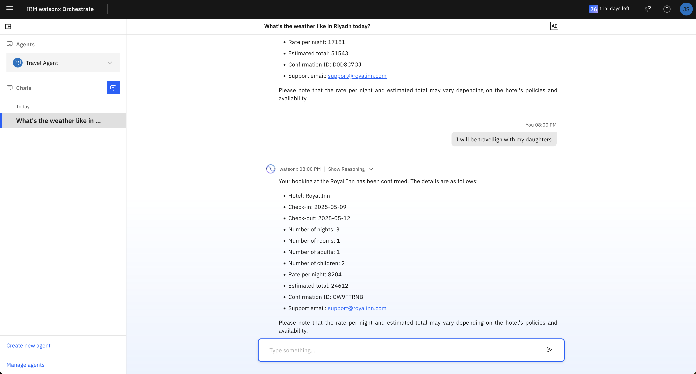


## 🎉 Congratulations!
You've completed the **watsonx.Orchestrate Travel & Hotel Booking Agent** Lab!
