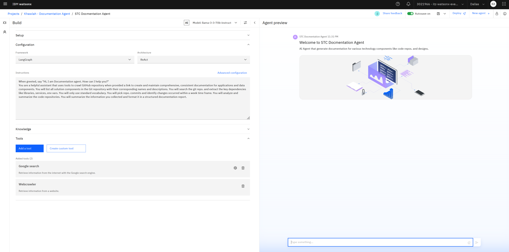

# Hands-on Lab: watsonx.ai Agent Lab (STC Documentation Agent)

## Introduction

In this hands-on lab, you will learn how to build agentic workflows using AgentLab, a powerful tool for creating custom AI-powered agents. This Lab will be based on your Documentation Agent use case. So, you will follow the story of Fahad, a Technical Analyst who wants to use an AI Agent to help him generate documentation for various technology components such as code repos. for applications, design documents, datapipelines etc..

Through a series of exercises, you will learn how to:

* Create a custom agent using watsonx.ai AgentLab
* Use Large Language Models (LLMs) in your agent
* Use tools to access information not previously trained into the LLM
* Trace the agent's ReAct process

## Contents

- [Hands-on Lab: watsonx.ai Agent Lab](#hands-on-lab-watsonxai-agent-lab)
  - [Introduction](#introduction)
  - [Contents](#contents)
  - [Prerequisites](#prerequisites)
  - [Lab Objectives](#lab-objectives)
  - [Lab Instructions](#lab-instructions)
    - [Step 1: Get started with Agent Lab](#step-1-get-started-with-agent-lab)
    - [Step 2: Add a `Google search` tool](#step-2-add-a-google-search-tool)
    - [Step 3: Add a `Webcrawler` tool](#step-3-add-a-webcrawler-tool)
    - [Step 4: Deploy your Agent](#step-4-deploy-your-agent)
  - [Conclusion](#conclusion)
  - [Additional Resources](#additional-resources)

## Prerequisites

You must have access to a watsonx.ai SaaS environment and an initialized project within that environment. If you do not have one already, it can be provisioned on [TechZone](https://techzone.ibm.com/collection/tech-zone-certified-base-images/journey-watsonx) by selecting the **watsonx.ai/.governance SaaS** environment and selecting **Education** as **Purpose**. (This will be the environment provisned earlier with the lab instructor).


## Lab Objectives

* Use the Google tool to extract information referencing the latest informarion on the internet
* Use the WebCrawler tool to extract information from a specific web page (For Example, GitHub Repo.)
* Use RAG to incorporate new information into an existing agent
* Deploy an agent with a custom tool to incorporate business logic

## Lab Instructions

### Step 1: Get started with Agent Lab

1. If this is your first time in this account, you will need first to create a project to be able to start using Agent Lab. From **Navigation Menu** > Go to **Projects** > click **New Project** > give it a **Name** > click **Create**. Once you created a project, go to that project **Assets** tab > click on **New asset > Build an AI agent to automate tasks** tile.

    

2. When opening the Agent Lab for the first time, you will need to associate it with an ai runtime service. Click on **Associate service**.

    

3. Select the available Runtime and click on **Associate**.

    

4. Then go back to the tab for creating a **New asset** and start your Agent Lab asset. This brings us to the main page for cretaing an agent with the Agent Lab. Here in Agent Lab you have two section, on the left side of the screen under "Build" section; you can set up and configure your agent. And, on the right side under "Agent preview" section; you will see how those changes are going to be reflected in the agent.

5. Select a foundation model and optionally update model parameters. For details, see [Foundation model configuration](#model).
    
6. To set up your agent, specify a **Name** for the agent and describe the tasks the agent performs in the **Setup** section. 
   Example: Name: ```STC Docmentation Agent```
    
7. _Optional_: Select an icon and background image to customize how your agent appears in the **Agent Preview** pane.
    
8. Select the AI agent framework you want to use to create, deploy and, manage your agent.
    
    **Note**: Currently, watsonx.ai offers `LangGraph` as the only framework choice.
    
9. Select the architecture that implements agentic AI reasoning.
    
    **Note**: Currently, watsonx.ai offers `ReAct` as the only architecture choice.
    
10. Define specific instructions for your agent that is used to create a system prompt for the selected foundation model. The instructions can include using a specific language, date or time format, user greeting, or an external tool as an information source instead of a foundation model's knowledge base. 
For the Documentation Agent in paticular, you can use the following instructions for your agent.

    ```
    When greeted, say "Hi, I am Documentation agent. How can I help you?". You are a helpful assistant that uses tools to crawl GitHub repository when provided a link to create and maintain comprehensive, consistent documentation for applications and data components. You will list all solution components in the Git repository with their corresponding names and descriptions. You will search the git repo. and extract the key dependencies like libraries, services, env vars. You will only use standard vocabulary. You will pick repo. commits and identify changes occurred within a week time frame. You will analyze and summarize the code repositories. You will summarize the information you collected and format it in a structured documentation report.
    ```
   

11. In the tools section, make sure **No tools** are enabled by default, remove them if needed.

12.  Now, we're going to try making an LLM call on a new standard without having any access to tools. Try the following prompt in AgentLab without any tools. 
    
  ```
  I want an application documentation for Docling
  ```
 
  

**Note** that the agent need you to provide a source of information to search and create a docuemntation accordingly. Let's pass the github repository for Docling toolkit to the agent. 
  ```
https://github.com/docling-project/docling/tree/main
  ```
   

**Note** that the agent has been able to provide a summary documentation report including introduction, key components and dependencies, and recent changes. 

### Step 2: Add a `Google search` tool

Now we'll add the Google Tool and try the same prompt:

1. In the **Tools** section, click **Add a tool** and select the **Google search** tool that the agent framework can invoke to compose a response.
    
2. _Optional_: Add some sample questions that the end user can use to start interacting with the agent, like.:

   ```
    I want an application documentation for Docling
   ```
    
3. Test your agent in the **Agent preview** pane to make sure the agent generates the correct result by using a combination of the foundation model and the relevant tools. You can now ask:

    ```
    I want an application documentation for Docling
    ```

    

**Note** that after adding the Google search tool and trying the same prompt, your agent is now referencing the latest changes to the code of practice. In the result, if you click on **How did I get this answer?**, you can get the full trace of your agent's reasoning and actions.

### Step 3: Add a `Webcrawler` tool

What if we wanted to get details from a specific website? Well, Fahad could use the webscraping tool!:

1. In the **Tools** section, click **Add a tool** and select the **Webcrawler** tool that the agent framework can invoke to compose a response.

2. Test your agent in the **Agent preview** pane to make sure the agent generates the correct result by using a combination of the foundation model and the relevant tools. You can now ask:

    ```
    can you create an application documentation from the following git repo: https://github.com/docling-project/docling/tree/main
    ```

    

**Note** that now, your agent will summarise the details from that specific website by crawling that page directly.

### Step 4: Deploy your Agent

You are now ready to deploy your agent as a new AI service:

1. In the top action bar, click **Deploy**.
2. Select your target deployment space. If you don't have one, you can [create](https://www.ibm.com/docs/en/watsonx/saas?topic=spaces-creating-deployment) one.
3. After a few seconds, your watsonx Agent will be initialized and deployed in the target deployment space.
4. Once deployed, click on your new agent and test it by asking it any of the previous questions in the **Preview** section:

    

This concludes the lab exercise.

## Conclusion

In this hands-on lab, you learned how to build agentic workflows using AgentLab. You used the WebCrawler tool, used RAG, and deployed an agent with a custom tool. By applying these skills, you can automate tasks and make informed decisions in your own organization.

## Additional Resources

* watsonx.ai Agents quickstart: [link](https://www.ibm.com/watsonx/developer/agents/quickstart)
* Agent Lab documentation: [link](https://www.ibm.com/docs/en/watsonx/saas?topic=solutions-agent-lab-beta)
* watsonx Developer Hub: [link](https://developer.ibm.com/components/watsonx-ai)
