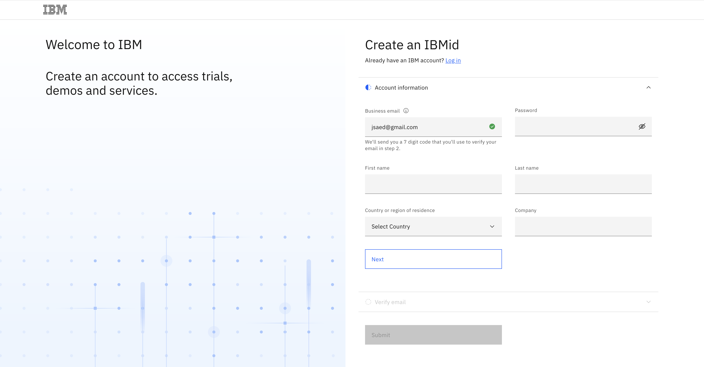
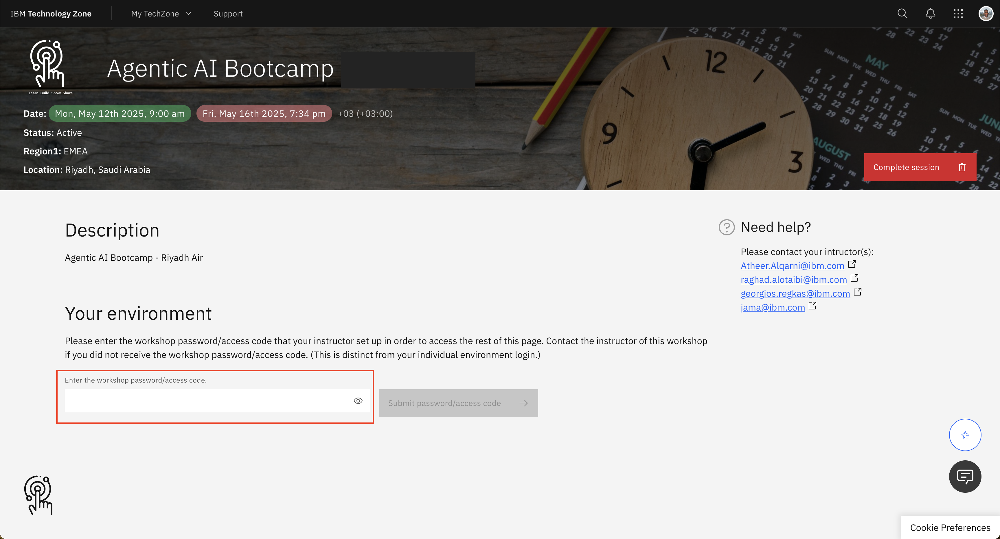
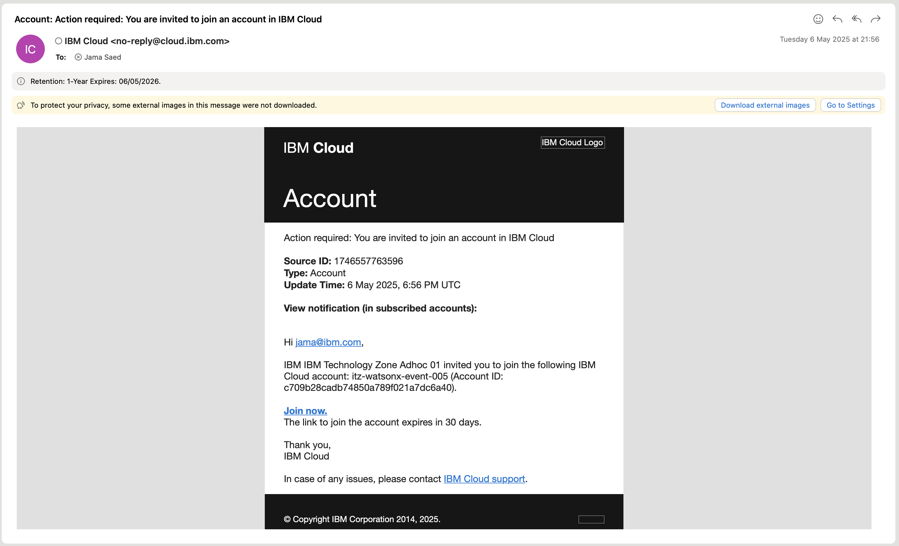

# Lab 0 - Accessing the IBM watsonx.ai Platform

## Contents
- [1. Create an IBMid](#1-create-an-ibmid)
- [2. Access your workshop environment via the Attendee URL](#2-access-your-workshop-environment-via-the-attendee-url)
- [3. Accept the invitation to join the IBM Cloud Account](#3-accept-the-invitation-to-join-the-ibm-cloud-account)

---

### 1. Create an IBMid
To access the workshop environments, you must first create an **IBMid**.

- Navigate to [Sign up for My IBM account page](https://www.ibm.com/account/reg/us-en/signup?formid=urx-19776).
- Fill the required fields present in the *Account Information* section and click *Next*.
- The **email address** that you specify in the form is your username/ **IBMid**.
- Enter the verification code to verify your email ID and click Create account. The IBMid multi-factor authentication enrollment page opens.
Select your preferred verification method. When completed, the user account is created.

- After completing the above steps you will see the landing page for My IBM, logged in with your new IBMid.

### 2. Access your workshop environment via the Attendee URL
Once you've obtained your **IBMid**, navigate to the [Attendee URL](https://techzone.ibm.com/my/workshops/student/681a3aba796fbe5a44f84c30)

When prompted to login, use your newly created IBMid.

#TODO: Add attendee-url.png

- Read and agree to the *Terms of Service*
- There will be a `Welcome to IBM Technology Zone!` - you can click skip for now.
- Enter the workshop password/access code: `RiyadhAir@2025`

Once logged in, you will see the Service URLs to access the environments!

#TODO: Add techzone-final.png

### 3. Accept the invitation to join the IBM Cloud Account
After completing the above steps, you will be sent an invitation to join the IBM Cloud Account associated with your unique environment. This will take approx. 5 mins to arrive, so be patient!

❗ Click `Join now` to accept the invite. You will be asked to log into IBM Cloud (use the IBMid credentials created earlier).

**That's it! Congratuations, you're ready to get started with the Labs!