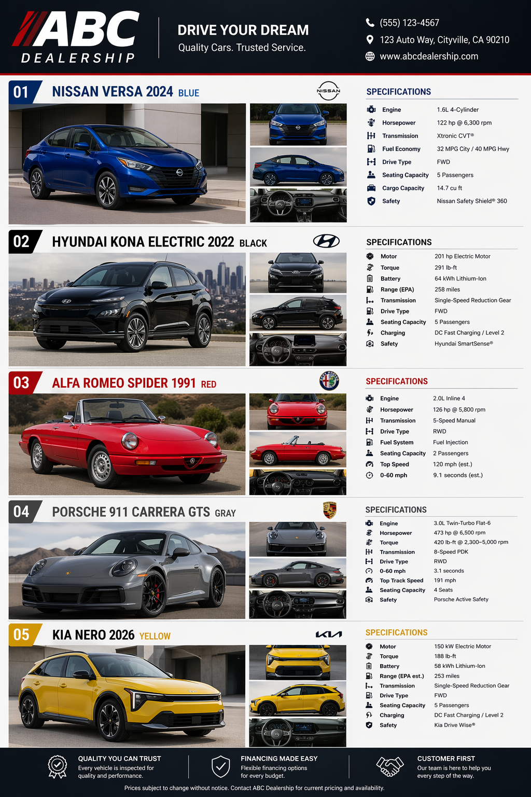
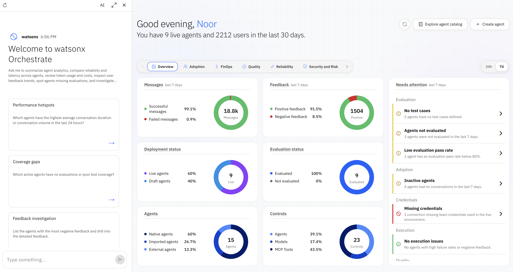
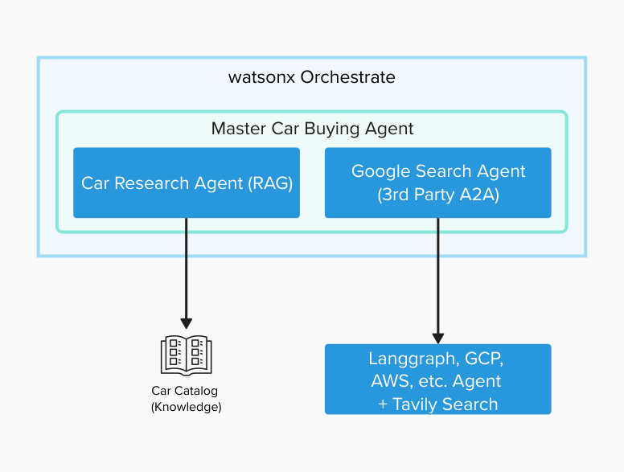

# 🎬 Lab 0: Scenario & Objective

## The Scenario

Imani is an AI Engineer working for **ABC Car Dealership**. She is building an Agentic AI application to help customers answer questions on their catalog of vehicles. However, she's afraid of many potential risks related to Generative AI, namely *generation of harmful contents, hallucinations, agent sprawl, prompt injection*, among other risks. She's aware that malicious users have successfully attacked AI systems to trick them into promotions or sales deals against the company policy.

The **ABC Car Dealership** catalog of vehicles is provided as part of this lab's assets.

## 🎯 Objective

In this lab, you will help Imani implement **Agentic AI Controls and Governance** capabilities to address:

- 🧪 **Prompt injection**: a malicious user interacting with the system could instruct the LLM to generate harmful content, change its behavior, or perform dangerous actions.
- 🥵 **Hallucinations**: in some cases, an LLM might generate false statements called hallucinations.
- 🤢 **Toxic output (HAP)**: in some cases, the system might generate hateful, abusive, or profane output (HAP). IBM's HAP filter uses AI to prevent harmful content generation.
- 💧 **PII Leakage**: personal identifiable information might be present in knowledge bases or might be generated by agent tools.
- 🕸️ **Agent Sprawl**: how to manage and govern a large number of agents in an organization.
- ✅ **Quality evaluation**: it's always a good practice to measure the quality of an AI system's output before going to production.
- 📊 **Monitor**: provide real-time metrics to ensure agents have high performance and low risk.
- 🚨 **Alerts**: notify when there's a breach in quality metrics, model, or system performance.
- 🐛 **Debugging**: diagnose tool/agent failures, find root cause, and quickly fix issues.

## 📈 Business Value

- 🕸️ **Prevent Agent sprawl**: uncontrolled proliferation of agents increases complexity, computation cost, and increases risk, hence the need to manage and govern a large number of agents in an organization.
- 🛡️ **Reputation protection**: Imani is concerned that her organization's reputation might be affected if the AI systems she and her team build are subject to attacks, authorize deals against company policy, or generate harmful, toxic, or unreliable outputs.
- 🚫 **Regulatory infractions and legal issues**: many AI risks are addressed by laws and regulations in various jurisdictions. Risk-management tools covered in this workshop help reduce potential legal and regulatory compliance exposure.
- 📈 **Productivity**: Imani's team saves time on manual evaluations and quality checks, and on manually monitoring their models and AI systems.

## 🎰 Check the Demo

This is the final result of what you will be building across Labs 1–8. Explore the [Agentic Control Plane](https://wxdemo.ibm.com/) to see the finished dashboard, alerts, and agent analytics in action before you start building.

## 🏛️ Architecture

The workshop uses a **Master Car Buying Agent** hosted in watsonx Orchestrate, which orchestrates two sub-agents:

- **Car Research Agent (RAG)** → grounded on the **Car Catalog (Knowledge)** base.
- **Google Search Agent (3rd-Party A2A)** → connects out to a **LangGraph / GCP / AWS agent + Tavily Search** for live web lookups.

Across Labs 1–8 you'll add governance controls (guardrails, PII protection, monitoring, evaluation) around this architecture.

## Pre-requisites

**Environment setup (for instructors):** Instructors must complete the instructor guide to provision a watsonx Orchestrate environment and deploy the required third-party agent for participants. Upon completion, instructors will be able to provide participants with the **Agent Endpoint URL** and the **API Key**, required for the labs.

**Participants:**
- Access to a watsonx Orchestrate instance
- Third-party Agent endpoint URL: https://car-agent-655459409396.us-central1.run.app
- Third-party Agent API key (provided by instructor)
- Vehicle Catalog in PDF

Let's get started with [Lab 1: Data Poisoning](../lab-1-data-poisoning/README.md)!

---

**[🏠 Home](../../README.md) &nbsp;&nbsp;|&nbsp;&nbsp; [Next: 1. Data Poisoning →](../lab-1-data-poisoning/README.md)**
